# 🧵 Hytale – Hide Drops por Mob

> Relación **Mob → tipo de Hide**  
> (nombre del mob derivado del archivo `Drop_*.json`, sin extensión)

> 📌 Imágenes ubicadas en `../images/`  

---

## 🟥 Heavy Hide

| Mob | Preview |
|---|---|
| Bear_Grizzly |  |
| Bear_Polar |  |
| Crocodile | 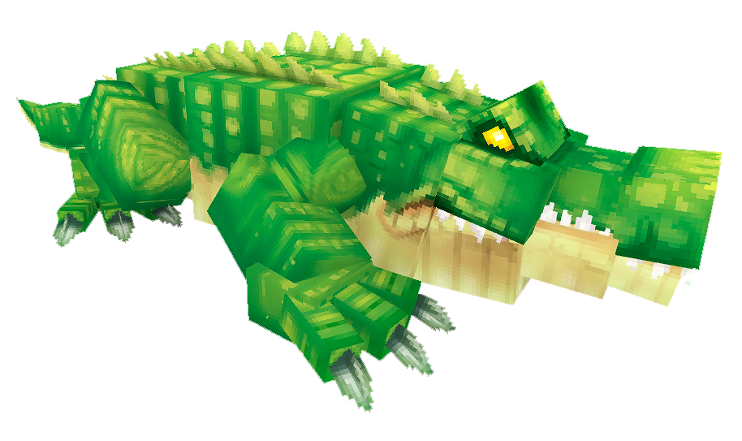 |
| Emberwulf | 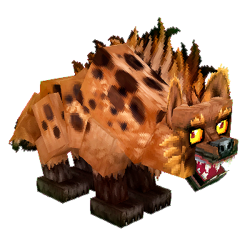 |
| Rex_Cave | 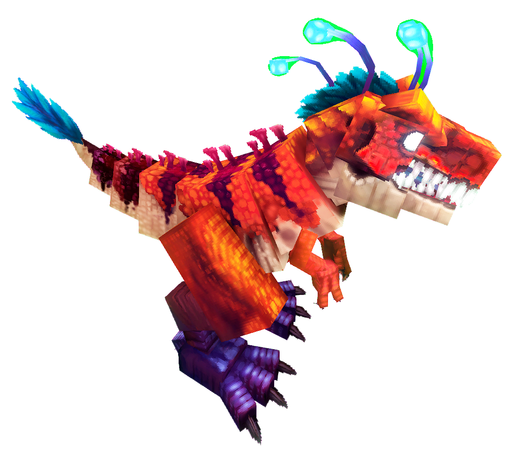 |
| Yeti | 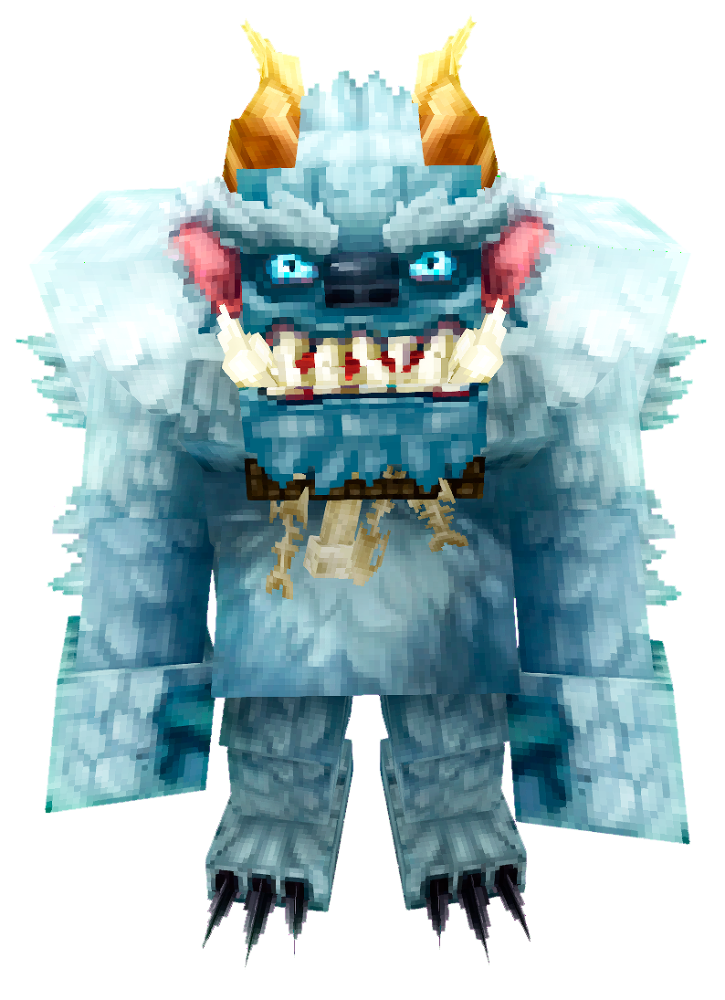 |
| Mosshorn | 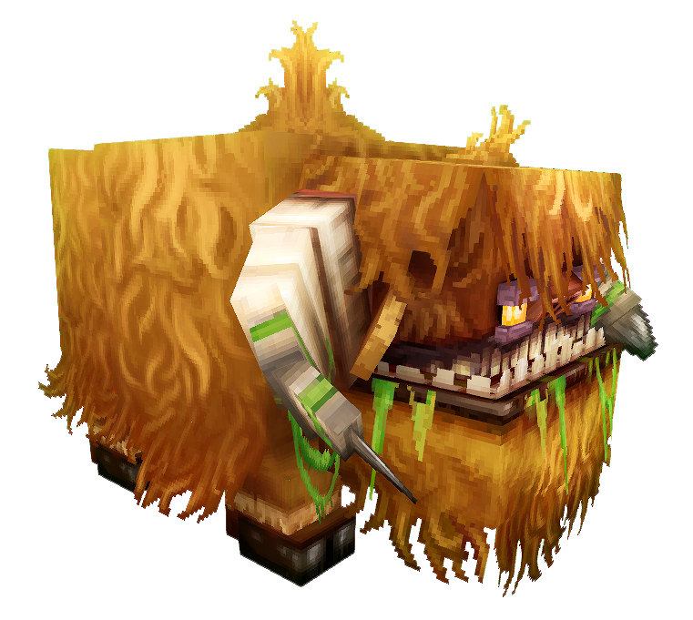 |
| Trillodon | 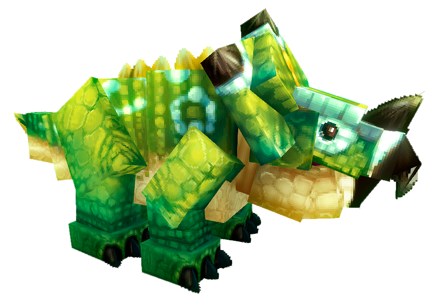 |

---

## 🟧 Medium Hide

| Mob | Preview |
|---|---|
| Hyena |  |
| Leopard_Snow |  |
| Lizard_Sand |  |
| Raptor_Cave | 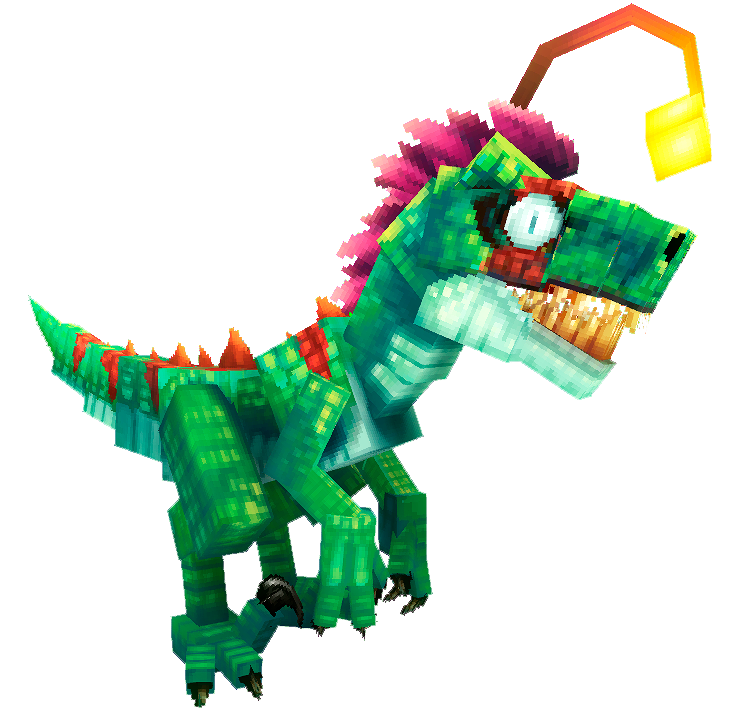 |
| Slug_Magma |  |
| Tiger_Sabertooth | 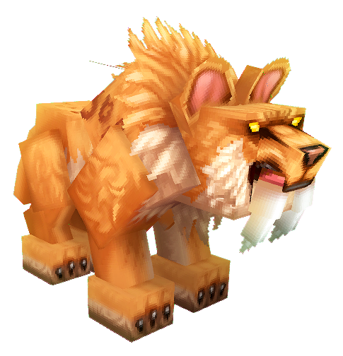 |
| Toad_Rhino |  |
| Toad_Rhino_Magma |  |
| Wolf_Black |  |
| Wolf_White |  |
| Bison | 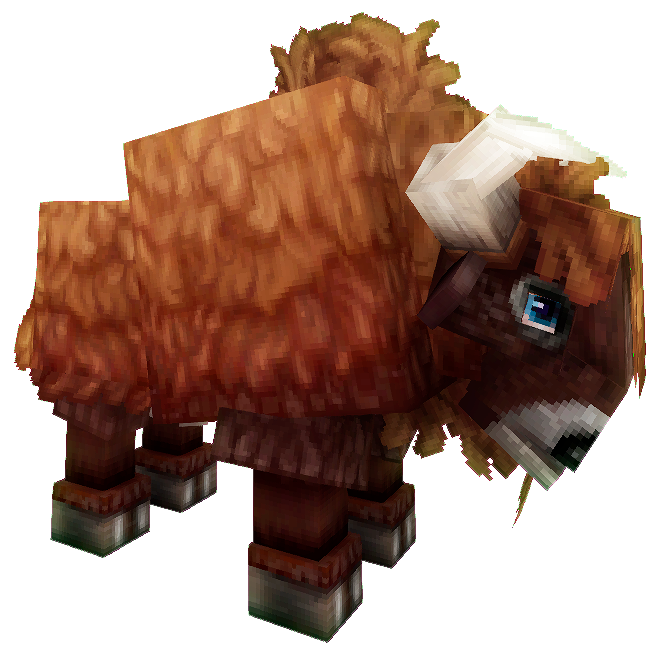 |
| Boar | 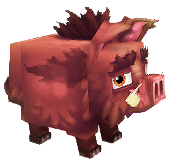 |
| Cow | 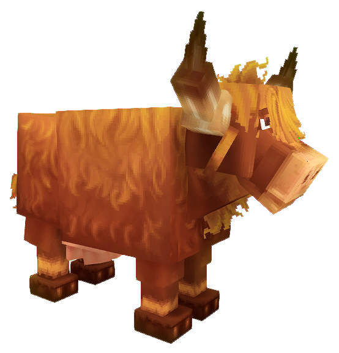 |
| Horse | 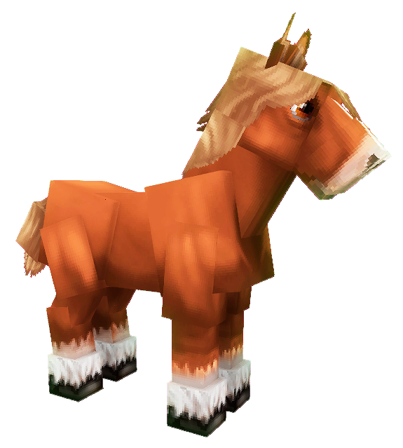 |
| Warthog | 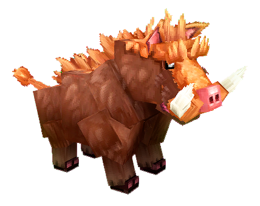 |
| Fen_Stalker |  |
| Hound_Bleached |  |
| Moose_Bull |  |
| Moose_Cow |  |

---

## 🟩 Light Hide

| Mob | Preview |
|---|---|
| Molerat | 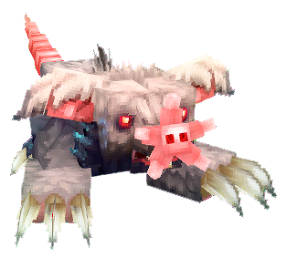 |
| Rat | 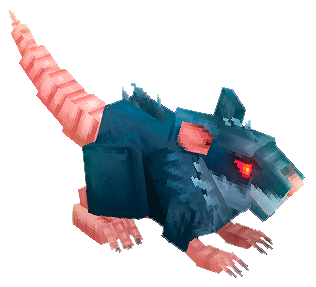 |
| Camel | 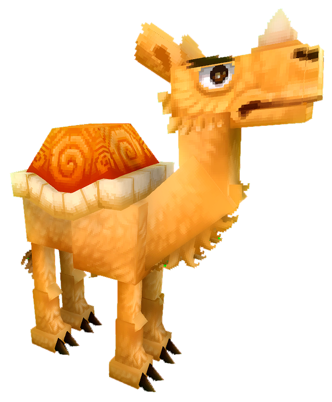 |
| Chicken | 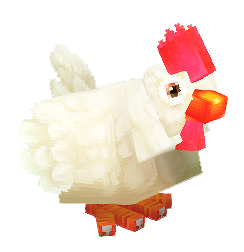 |
| Chicken_Desert |  |
| Goat | 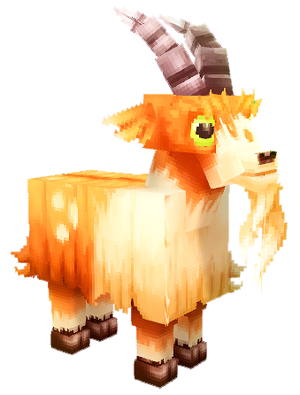 |
| Mouflon | 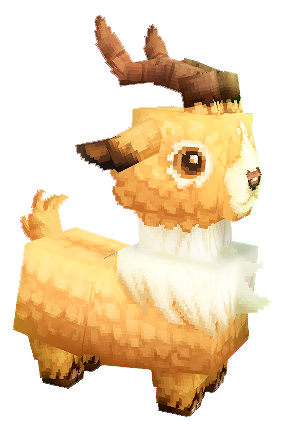 |
| Pig |  |
| Rabbit | 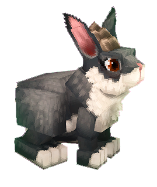 |
| Ram | 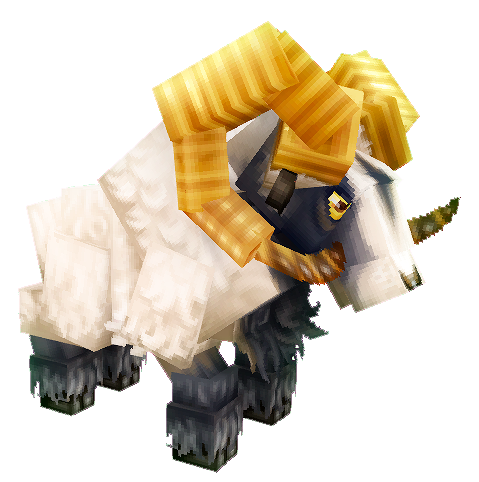 |
| Sheep | 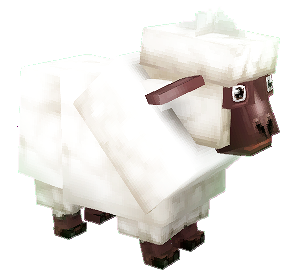 |
| Skrill |  |
| Turkey | 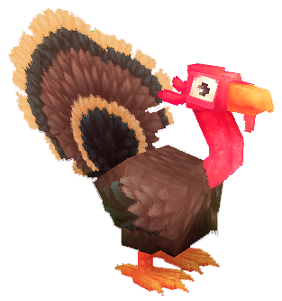 |
| Chicken_Undead |  |
| Cow_Undead |  |
| Pig_Undead |  |
| Antelope | 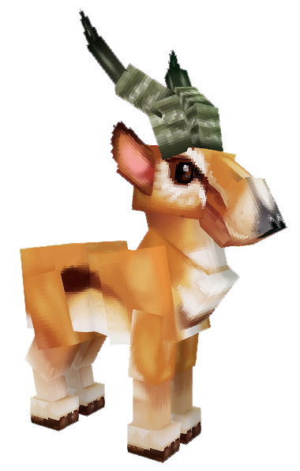 |
| Deer_Doe |  |
| Deer_Stag |  |

---

## ℹ️ Notas
- El tipo de hide **depende del rol/tamaño del mob**, no de su HP.
- Los nombres de imagen coinciden **1:1** con los archivos del repo.
- Ideal para rutas de farmeo, wikis o posts visuales.
